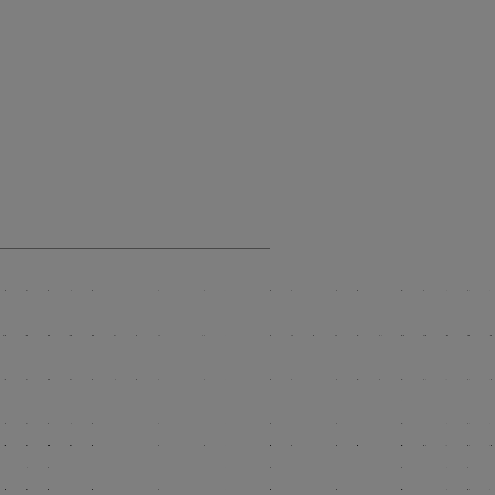
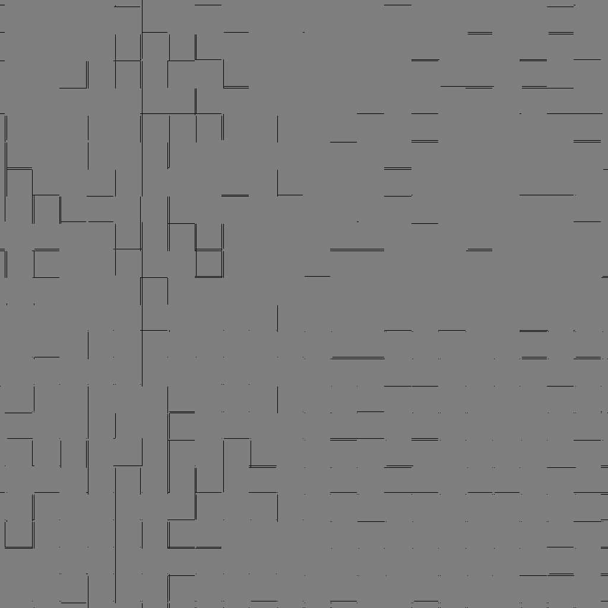
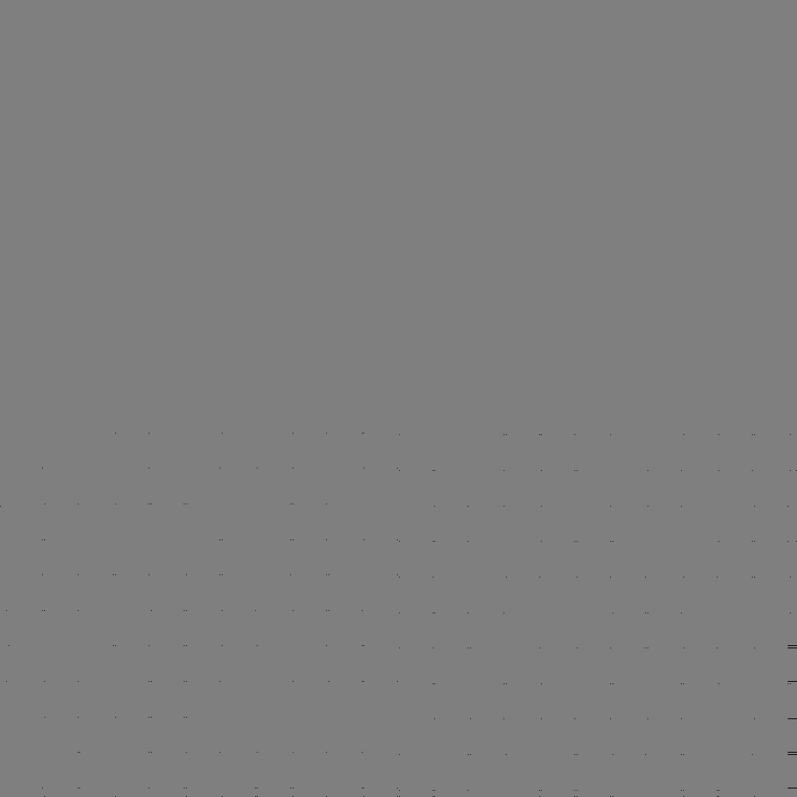
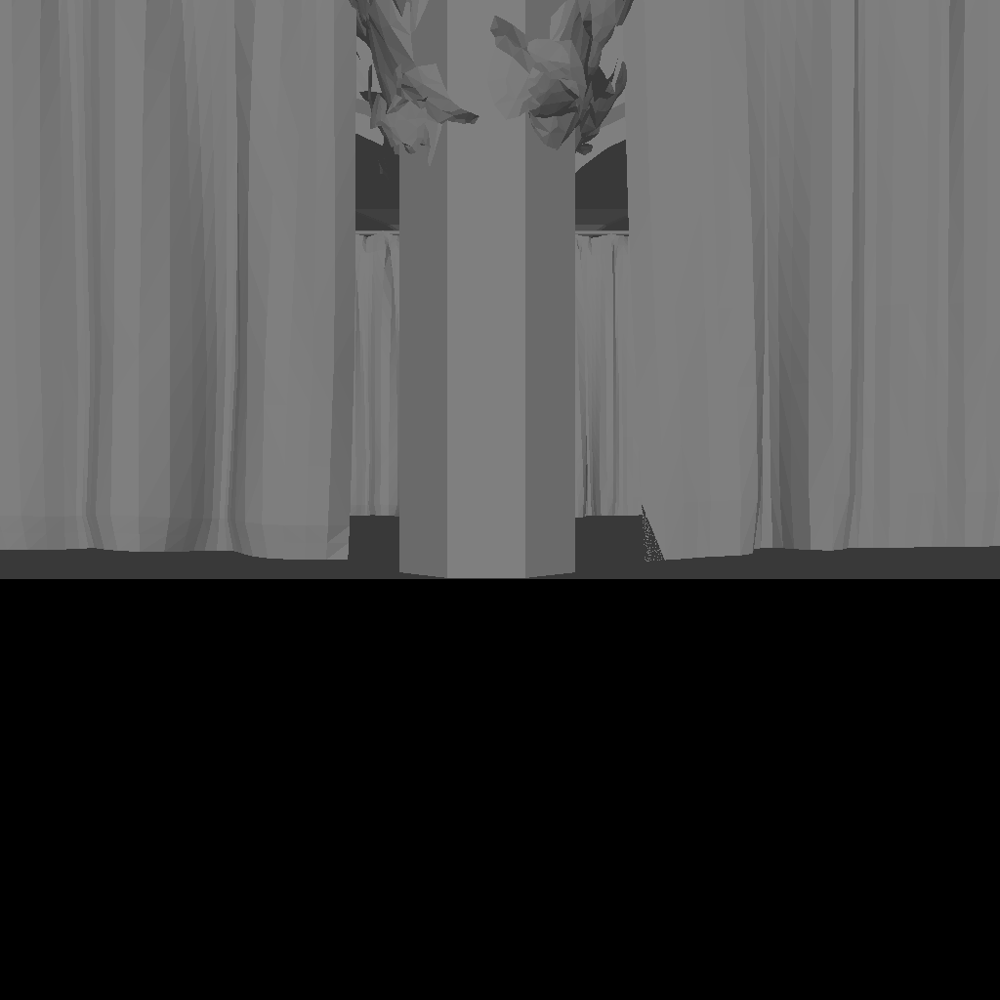
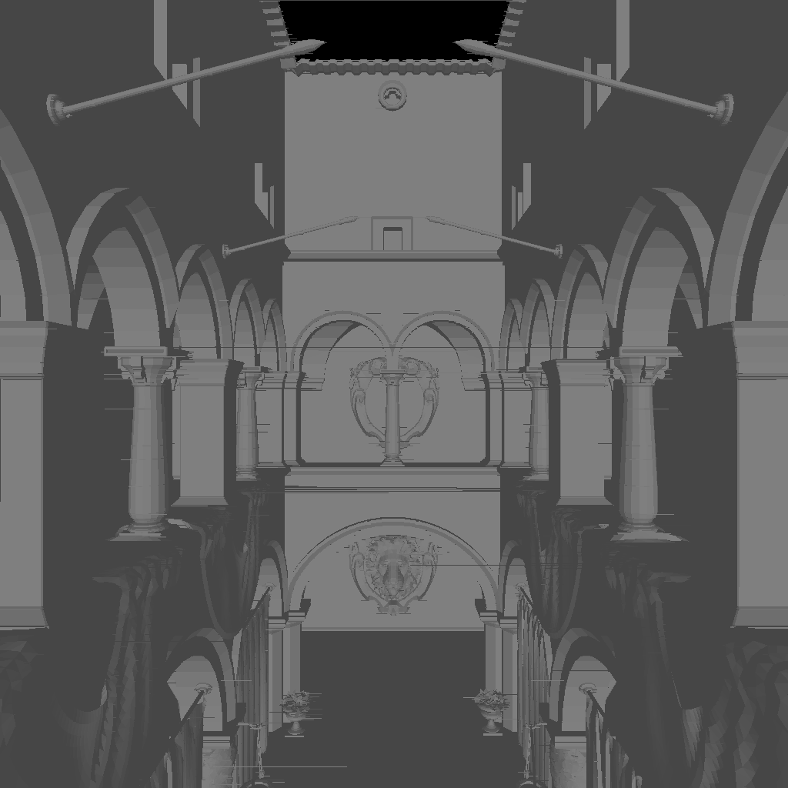
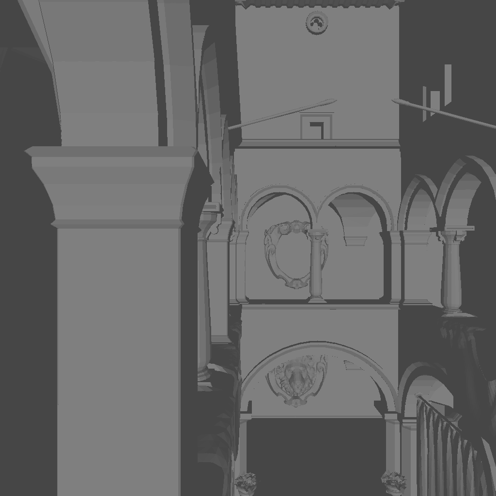
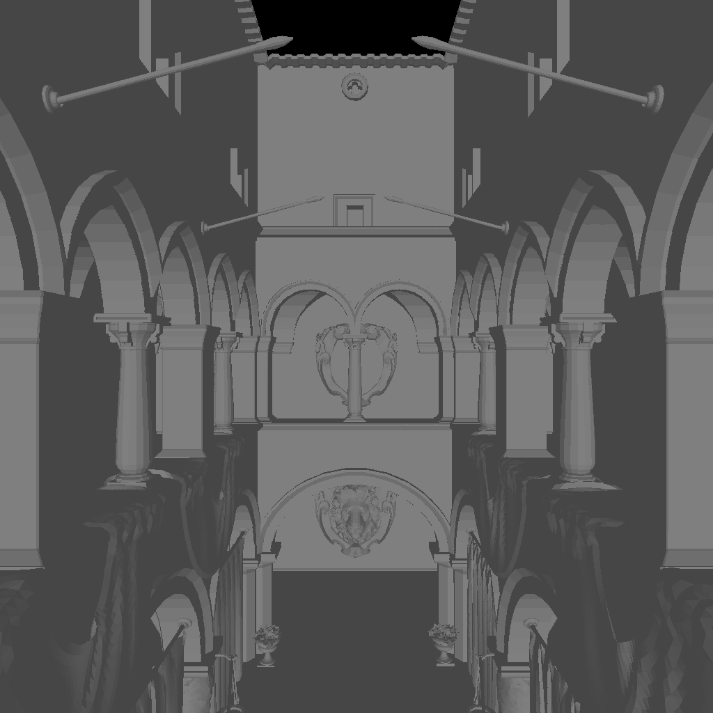
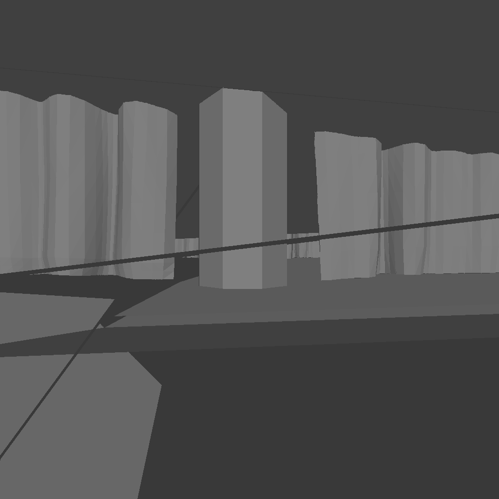
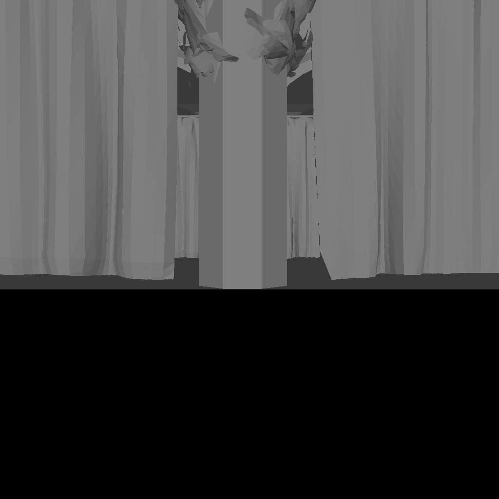

# HierarchicalZBuffer

> 层次 Z-Buffer 消隐算法：用 C++14 手工光栅化实现六种消隐算法并横向对比，
> 全程不调用任何图形 API（无 OpenGL / DirectX / GPU）

用 C++14 从零实现的一组**消隐（hidden surface removal）算法**对比程序。全部算法手工光栅化，
**不调用任何图形 API**（无 OpenGL / DirectX / GPU），仅依赖 [glm](https://github.com/g-truc/glm)
做向量矩阵运算、[stb](https://github.com/nothings/stb) 输出 PNG。

程序依次渲染 **11 个场景**（`models/` 下的 6 个 OBJ 模型、建筑场景 Sponza、以及 4 个在
程序内生成的高遮挡"体素城市"），每个场景用 6 种算法各渲染一张 1024×1024 的图，
把结果写入 `results/` 并在控制台打印耗时 —— 一次运行约 7 秒，产出 66 张图。

> A from-scratch C++14 comparison of six hidden-surface-removal algorithms
> (naive / classic scanline / specialized scanline Z-buffer, simple and full hierarchical Z-buffer
> with BVH or octree), rasterized entirely by hand with no graphics API.

## 效果图

`results/` 下是按 `<算法>_<模型>.png` 命名的输出，11 个场景 × 6 种算法共 66 张。例如：

| 普通 Z-Buffer | 经典扫描线 | 特化扫描线 | 简单模式 | BVH | 八叉树 |
|---|---|---|---|---|---|
|  |  |  |  |  |  |

同一场景（4 个程序内生成的高遮挡"体素城市"，M28 完全遮屏）在六种算法下的输出：

| 普通 Z-Buffer | 经典扫描线 | 特化扫描线 | 简单模式 | BVH | 八叉树 |
|---|---|---|---|---|---|
|  |  |  |  |  |  |

真实建筑场景 Crytek Sponza（相机位于模型内部）：

| 普通 Z-Buffer | 经典扫描线 | 特化扫描线 | 简单模式 | BVH | 八叉树 |
|---|---|---|---|---|---|
|  |  |  |  |  |  |

## 核心特性

六种算法共用同一套场景、相机与扫描线光栅化内核，因此在同一台机器、同一批场景上可以直接横向比较。

| 算法 | 说明 |
|---|---|
| 普通 Z-Buffer | 逐三角形求包围盒，盒内每个像素用重心坐标判内外，再做深度测试。作为朴素基线 |
| 经典扫描线 Z-Buffer | 图像序。建立分类边表（ET），逐扫描行维护活化边表（AET）与边对，行内增量递推 x 与深度 |
| 特化扫描线 Z-Buffer | 图元序。逐个三角形处理，按其跨越的扫描行推进，跨行状态全部放在函数栈上的局部变量里，不需要任何全局表 |
| 简单模式层次 Z-Buffer | 用 Z-max 金字塔维护深度层次，三角形先与区域最大深度比较，被完全遮挡则跳过光栅化。不预先排序 |
| 完整模式层次 Z-Buffer（**BVH**） | 在简单模式基础上叠加**模型空间** BVH，递归时对每个节点做一次遮挡判断，被遮挡则整棵子树跳过。BVH 与相机无关，可跨帧复用 |
| 完整模式层次 Z-Buffer（**八叉树**） | 同上，但场景结构换成空间八叉树。8 个子节点**互不重叠**，因此"按最小深度排序"能得到真正有效的由近到远顺序 |

## 构建与运行

**C++17**。依赖只有两项，均已随仓库提供，无需额外配置：
`include/glm/`（向量矩阵运算）、`src/stb_image*.hpp`（PNG 读写）。

### CMake（推荐）

```bash
cmake -B build                              # Windows 上会自动选用已安装的 Visual Studio
cmake --build build --config Release

# 单配置生成器（Ninja / Makefile）下可以省掉 --config：
#   cmake -B build -G Ninja -DCMAKE_BUILD_TYPE=Release && cmake --build build
```

产物在 `build/Release/HierarchicalZBuffer.exe`（单配置生成器下是 `build/HierarchicalZBuffer`）。

### Visual Studio 解决方案

`HierarchicalZBuffer.sln` 仍然保留：直接打开，选 Release | x64 运行即可。

> **两条构建路径的产出是逐字节相同的**（已核对 36 张自带模型的结果图）。
> 程序的工作目录必须是**工程根目录**（要读 `models/`、写 `results/`）：
> CMake 已经通过 `VS_DEBUGGER_WORKING_DIRECTORY` 配好，在 Visual Studio 里 F5 可直接运行；
> 命令行下请在根目录执行，或者留意相对路径。

## 使用方式

不带任何参数时渲染全部 11 个场景 × 6 种算法，共 66 张结果图，整轮约 7 秒：

```bash
HierarchicalZBuffer.exe
```

**其中 4 个高遮挡场景是程序内生成的**（见 `src/occlusionScene.hpp`），不需要额外的模型文件。

### 命令行选项

```
  -s, --scene <名>[,名...]   只渲染指定场景（用 --list 查可用名字）
  -a, --alg   <名>[,名...]   只运行指定算法
  -l, --list                 列出可用的场景与算法后退出
  -n, --repeat <次数>        每个场景每个算法重复渲染的遍数（默认 1）
      --stats  <min|mean|median>
                             重复多次时报告的统计量（默认 mean）
  -o, --output <目录>        结果图输出目录（默认 results）
      --no-images            不写结果图，只计时
      --verify <目录>        渲染后与 <目录> 下的图逐字节比对
  -h, --help                 显示用法
```

场景名与算法名就是结果图文件名的两半（`<算法名>_<场景名>.png`），所以 `--alg` 与
`--verify` 用的是同一套名字，不需要额外的映射表。

几个例子：

```bash
# 只看一个场景上三种层次 Z-Buffer 的差别
HierarchicalZBuffer.exe --scene sponza --alg BasicHierarchicalZBuffer,HierarchicalZBuffer,OctreeHierarchicalZBuffer

# 复现上面性能数据的采集方式：每个组合跑 10 遍取平均
HierarchicalZBuffer.exe --repeat 10 --no-images

# 回归验证：先在已知正确的版本上生成一份金标准，之后任何改动都拿它逐字节比对
HierarchicalZBuffer.exe --output golden
HierarchicalZBuffer.exe --output out --verify golden
```

退出码：`0` 正常；`1` `--verify` 发现不一致（或金标准缺失）；`2` 参数错误。

> 性能数据请务必在 **Release** 配置下采集。Debug 配置下 glm 的模板数学无法内联，
> 光栅化部分会慢 10~30 倍，而层次结构的构建只慢约 1.1 倍，
> 各算法之间的相对关系会被严重扭曲。

## 实现要点

**共用的扫描线光栅化内核**（`triangleRasterizer.hpp`）
把三角形按扫描线切成"上半部分 / 下半部分 / 退化成水平线"三种情况，逐行从左到右遍历。
各算法只有"深度测试 + 写入深度"这一步不同
（普通 z-Buffer 写 Z-Buffer；层次 z-Buffer 还要向上更新金字塔），
因此把它做成回调参数、经模板内联展开，**三个类合计 515 行重复代码收敛为 201 行共享实现**。
覆盖范围按**整数格点采样**判定：行取 `[ceil(ymin), floor(ymax)]`、跨度端点取
`[ceil(xLeft), floor(xRight)]`，与普通 Z-Buffer 的重心坐标判定完全一致（相邻三角形共享一条边时，
一边的 floor 与另一边的 ceil 恰好相邻，不会留缝）。早期版本一律向零截断，会把三角形之外最多
1 像素的行/列也算进来 —— 那一行上的深度是平面方程外推出来的，在体素城市这类场景里它会与
邻面的深度**逐位相等**，于是谁后画谁赢，画面上就是沿立方体棱的一圈 1 像素黑线。

**深度逐像素代回平面方程求值**（而不是沿扫描线累加状态）
解出深度增量的 dzx、dzy 之后，平面就是已知的：
`z(x, y) = face[0].z + (face[0].y - y) * dzy + (x - face[0].x) * dzx`，每个像素直接代入。
原先的写法是逐行累加 `z += dxleft * dzx + dzy`，问题出在这两项经常是一对量级相同、
符号相反的大数——三角形越窄长越极端（实测单步两个增量分别是 +13.34 和 −13.36，
真实变化只有 0.002），相减本身就是一次大数相消，误差再乘上成百上千行就积成了
肉眼可见的深度错误。

另一处必须同时处理：像素范围是用 `static_cast<int>` 向零截断得到的，
最左/最右那个像素的整数坐标可能落在该扫描行的真实跨度之外最多 1 像素。
对普通三角形这点外推无所谓，但窄长三角形 `dzx` 可以到几十，外推出去深度会被甩出视锥。
所以求值位置先夹回跨度之内——对跨度内的像素这是恒等变换，取值完全不变。

**视锥裁剪**（`Model::getClippedFace`）
分两步，因为这两步需要的信息不一样：

- **近平面在裁剪空间裁**。本工程里齐次坐标的 `w` 就是 `z_cam`，所以判据只跟 `w` 有关：
  `w <= -nearDistance`。用 Sutherland-Hodgman 对三角形裁一刀，裁出来最多 4 个顶点。
- **四条侧边在屏幕空间裁**。本工程把**视口变换也乘进了 MVP**，所以 `x_clip / w` 得到的
  已经是 `[0,W] x [0,H]` 的**像素坐标**、不是 NDC，判据要按屏幕矩形写，不能照搬
  「NDC 落在 [-1,1]」的 `x = ±w`。投影之后三角形在屏幕上的投影仍是三角形、深度仍是
  屏幕坐标的线性函数，所以这样裁是精确的。

裁完按扇形三角化成最多 6 个三角形。**这是让经典扫描线可用的关键**：只裁近平面时，
三角形仍可能远超视口左右/上下边界，活动边表会被撑爆（实测 43.9 秒、输出整屏纯色）；
裁到屏幕矩形后降到 31.91 ms 且输出正常。

**按屏幕面积跳过退化的三角形**
屏幕空间面积 = |c| / 2，低于 0.01 平方像素就整个跳过。
三个顶点几乎共线时，过这三点的平面本身就是病态的：实测某个三角形三个顶点的深度
只相差 0.0025，解出来的 dzx 却是 **−2.12/像素**（即每挪动一个像素深度就变化 2.12，
比它自身的深度跨度大三个数量级）——因为另外两个顶点只相距 0.001 像素、深度却差 0.0025，
平面把这个比值当成了真实斜率。这种三角形的片元深度没有任何意义，而它本来也覆盖不到
一个像素，跳过它既修掉噪声、又省掉无谓的遍历。

**经典扫描线做了同样的三件事**（`scanlineZBuffer.cpp`）：给活动边表补上「左边缘进入扫描线时的
参考点 (xRef, yRef, zRef)」，渲染时同样用平面方程求值、把求值位置夹回跨度、并按面积跳过
退化三角形。

**深度一律取 -z，不取 |z|**
本工程的投影把近平面映到 z_ndc = +1、远平面映到 -1（即所谓反向 Z，z_ndc 随距离单调**递减**）。
而 z-Buffer 的常规约定是「深度越小越近、z-test 用 `<`」，要求深度随距离单调**递增**，
所以统一取 **-z**：它把整个视锥线性翻转回来，取值正好落在 [-1, +1]，与常规深度缓冲一致，
而且就是同一个 float 取负，没有任何额外开销。

`|z_ndc|` 则是关于距离的 V 形函数：在 z_ndc 的过零点取到最小值 0，而这个点在本工程的
参数下位于相机前方 **0.598** 处 —— 那是视锥**内部**（近平面在 0.3），不是近平面。
也就是说 d < 0.598 的那段几何前后关系会被整体反转：离相机**更近**的反而被判为更远。
自带 6 个模型在默认机位下全部落在 d ∈ [0.885, 2.715]，完全没碰到这个区域，
所以对**所有合法片元**两种写法逐位相同；但把相机推到 z = 1.3、让 bunny 进入 d_min = 0.525 后，
两种写法有 **21 660 个像素（2.07%）** 不同 —— 正好是跨过 0.598 的那个模型。

**场景参数可配置**（`scene.hpp` 的 `Scene::Config`）
相机位置/朝向、上方向、光线方向、视锥（near/far/fov）、环境光强度、渲染分辨率
全部可以按场景指定。默认值与重构前完全一致，所以不带参数时输出逐位不变。

这不是过度设计：自带模型都是**放在相机前面的单个凸物体**，默认相机 (0,0,1.8)、
fov 90、近平面距离 0.3 就够了；但建筑类场景要求相机**在模型内部**，
而且模型会被 `Model::loadModel` 按最长轴归一化到 [-1,1]³ —— 整栋 sponza 因此只有
2.0 × 0.84 × 1.23，近平面 0.3 就吃掉了建筑高度的三分之一，fov 90 下任何近处的墙
都会糊满整个画面。

同时加了一项**环境光**（默认 0）：只有单向光时 `max(0, dot(N, L))` 会把所有背光面
渲染成纯黑，对凸物体没问题，对建筑内部就只剩一片黑。

**Z-max 金字塔**（`zPyramid.hpp`）
用 mipmap 式的连续数组代替指针四叉树：第 0 层是逐像素的深度，第 L 层的每个单元覆盖
2^L × 2^L 像素、存该区域的最大深度，父单元是 `(x >> 1, y >> 1)`。
1024×1024 时共 1 398 101 个 float 约 **5.6 MB**，全部连续存储、没有任何指针。

相比之下，指针四叉树有同样多的节点，但每个节点是 2 次堆分配（节点对象 + children 数组），
合计约 280 万次 malloc、约 100 MB，**构建要 92 ms 且只与分辨率有关、与面数无关 —— 每个模型都要白付一次**。
换成金字塔后构建退化成一次内存填充（**0.20 ms**），而且因为访存连续，
连渲染本身也快了 2~5 倍。这是整个项目里收益最大的一次优化。

**遮挡判据与保守性**
若某区域的**最大深度**小于三角形的**最小深度**，则该区域内的任何片元都会被已有几何的
z-test 拒绝，可以整块跳过。判据是保守的 —— 不满足时可能白跑，但绝不会错误剔除。
写一个像素后要沿父链向上更新区域最大深度，且只在值真的变小时才继续往上走。

**两种场景加速结构**（完整模式）
都建在模型空间、与相机无关，可跨帧复用；渲染时把节点包围盒投影到屏幕空间
（投影 8 个角点后取包围盒 —— 透视投影把凸多面体映射成凸多边形，其屏幕包围盒与
深度极值必然在角点上取到）。递归时对每个节点先做一次遮挡判断，从粗层开始逐层下探；
一旦被判为遮挡，整棵子树直接返回。

- **BVH**：按循环轴 + 中位数划分的二叉树，叶子最多 20 个三角形
- **八叉树**：把归一化到 [-1,1]^3 的模型包围盒不断八等分，三角形按重心落到哪个
  八分体分组，叶子最多 20 个三角形、深度上限 16。每个节点同时存两份范围：
  互不重叠的**八分体单元**（用于排序）与节点内三角形的**紧包围盒**
  （三角形按重心分配可能略微越界，遮挡判断必须用它才安全）

## 性能数据

1024×1024，MSVC /O2 /Oi /GL，AMD Ryzen 9 7945HX3D，单位 ms，**取 10 次运行的平均值**，
均为单帧总时间（含各自特殊数据结构的建立时间）。取平均值而不是取最小值，是为了反映
程序在真实重复运行下的表现；代价是带上了运行间波动 —— 实测单次结果相对平均值的最大
偏差中位数约 5%，1 ms 量级的小场景偏差可以到 20% 以上，右下角几个上千毫秒的大场景也在
10~20%，看表时请把这个量级放在心上。

本表在**覆盖范围修正之后**重新采集（同一台机器、同样的 10 次全场景运行）。修正前后的
对照：66 个格子的总时间 5 458.5 ms → 5 315.7 ms（0.974×），逐格比值中位数 0.952、
最大 1.085 —— 修正带来的开销完全落在运行间波动之内（单次相对平均值的最大偏差中位数约 5%）。

### 全部场景

| 场景 | 三角形 | 普通 Z-Buffer | 经典扫描线 | 特化扫描线 | 简单模式 | BVH | 八叉树 |
|---|---|---|---|---|---|---|---|
| dolphins.obj | 1 692 | 2.90 | 1.27 | **0.72** | 1.54 | 2.35 | 1.75 |
| african_head.obj | 2 492 | 4.55 | 2.22 | **1.39** | 3.34 | 3.49 | 3.17 |
| teapot.obj | 9 216 | 4.49 | 3.11 | **1.81** | 2.93 | 4.63 | 3.48 |
| bunny.obj | 69 630 | 23.00 | 21.00 | **13.18** | 20.02 | 31.53 | 18.33 |
| robot.obj | 187 983 | 72.00 | 46.50 | **29.63** | 33.75 | 81.57 | 42.48 |
| armadillo.obj | 212 574 | 37.47 | 49.54 | **30.15** | 30.62 | 89.35 | 45.21 |
| **Sponza（建筑内部）** | 262 267 | 168.00 | 56.17 | **40.92** | 62.20 | 144.01 | 97.24 |
| **体素城市 M20 近→远** | 96 000 | 367.19 | 93.05 | 76.84 | **37.85** | 98.39 | 74.32 |
| **体素城市 M20 远→近** | 96 000 | 406.36 | 94.53 | 96.56 | 224.59 | 101.18 | **75.36** |
| **体素城市 M28 近→远** | 263 424 | 540.06 | 169.15 | 134.08 | **57.47** | 172.96 | 93.30 |
| **体素城市 M28 留缝 近→远** | 263 424 | 405.68 | 143.83 | 109.21 | **89.64** | 203.39 | 121.34 |

前六个是**单个封闭凸物体**，遮挡关系简单，所以层次 Z-Buffer 的剔除收益有限。

后五个是高遮挡场景。**体素城市**由 `src/occlusionScene.hpp` 在程序内生成
（与 `tools/genOcclusionScene.py` 生成的场景一致）：M×M×M 个互相重叠的立方体，
每条视线要穿过 M 层几何。M=28 时是 263 424 个三角形，与 Crytek Sponza 同量级。
程序内生成而不是提交 obj 文件，是因为四种组合加起来有 31 MB，而生成代码只有几十行；
顺带还能随手切换"近→远 / 远→近"的三角形顺序 —— 那正是层次 Z-Buffer 收益的前提。

**Sponza** 需要 `models/sponza.obj`（已随仓库提供），机位、视锥与光照见下方「场景参数」一节。

### 真实场景：Crytek Sponza（建筑内部）

`models/sponza.obj`，262 267 个三角形，相机放在门厅里、沿长廊朝 -x 看。
这是遮挡剔除领域的通用基准场景。**整栋建筑会被归一化成 2.0 × 0.84 × 1.23**
（按最长轴缩放并居中），所以机位、视锥、光照都要按室内尺度重设 —— 见下方
「场景参数」一节。

| 算法 | 渲染 | 建结构 | 总时间 |
|---|---|---|---|
| 普通 Z-Buffer | 168.00 | — | 168.00 |
| **经典扫描线** | **29.55** | 26.62 | 56.17 |
| **特化扫描线** | 40.92 | — | **40.92** |
| 简单模式 | 62.01 | 0.18 | 62.20 |
| 完整模式（BVH） | 70.04 | 73.97 | 144.01 |
| 完整模式（八叉树） | 73.86 | 23.39 | 97.24 |

（10 次平均值。经典扫描线虽然总时间排第二，但它的渲染部分 31.91 ms 是六者中最快的 ——
建表那 25.23 ms 是一次性的。）

六个算法的输出彼此一致（差异 5.55% ~ 6.26%，属正常的边界像素与深度并列仲裁差异）。

**这个场景真正考验的是视锥裁剪**（见「实现要点」）：相机放进建筑内部后，有 2.97% 的
三角形至少有一个顶点落在相机平面上或其后，不做裁剪就会被透视除法放大成盖满屏幕的
巨大多边形。补上完整视锥裁剪之前，经典扫描线要 43.9 秒且输出整屏纯色，现在是 31.91 ms
——**六者中最快的扫描线实现**。完整过程与前后对比见 [NOTES.md](NOTES.md)。

剔除统计（完整视锥裁剪之后）：

（下表的插桩数据采集于覆盖率修正**之前**：修正后金字塔内容略有变化，
剔除比例的量级不变，绝对数字会有几十个节点的出入。）

| | 节点 | 被剔除子树 | 叶子里的三角形 | 实际光栅化 |
|---|---|---|---|---|
| BVH | 32 761 | 28（0.09%） | 80 651 | 69 323（剔除 14%） |
| 八叉树 | 45 576 | 603（1.3%） | 74 660 | 66 558 |

值得注意的是：**节点级剔除在这里几乎不起作用**（BVH 只有 0.09%），真正干活的是视锥裁剪
（把叶子节点里的三角形从 26.2 万个减到 8.1 万个）与逐三角形的金字塔测试（再剔掉 14%）。
所以室内场景上**简单模式就够用了**（渲染 65.55 ms，比完整模式 BVH 的 72.06 ms 还快）。
这一条和体素城市上「八叉树显著更优」的结论正好相反，原因见 [NOTES.md](NOTES.md)。

### 从这些数字里能读出什么

三句话总结，详细推导与反例见 [NOTES.md](NOTES.md)：

1. **价值只在遮挡强烈时体现。** M28 完全遮屏场景上简单模式比普通 Z-Buffer 快 8.5×，
   但在单个凸物体上它毫无优势。
2. **前提是「由近到远」的绘制顺序。** 同一场景换成远→近，简单模式反而慢 5.9 倍 ——
   甚至比完全不剔除的特化扫描线还慢。
3. **空间划分（八叉树）优于物体划分（BVH）**，全部 11 个场景上快 1.1 ~ 2.0 倍；
   八叉树还基本做到了顺序无关，代价是每帧的建树开销。

## 正确性验证

### 六种算法交叉一致

以**普通 Z-Buffer**（逐像素重心坐标判定、几何完全不做取整）为基准，其余五种算法的输出差异
（像素个数，1024×1024）：

| 场景 | 特化扫描线 | 简单模式 | BVH | 八叉树 | 经典扫描线 |
|---|---|---|---|---|---|
| dolphins | 12 | 12 | 44 | 12 | 2 460 |
| african_head | 3 | 3 | 3 | 3 | 2 672 |
| teapot | **0** | **0** | **0** | **0** | 7 036 |
| bunny | 8 | 8 | 8 | 7 | 21 866 |
| robot | 15 | 15 | 26 | 15 | 16 088 |
| armadillo | 6 | 6 | 5 | 7 | 26 096 |
| Sponza | 344 | 344 | 359 | 346 | 17 404 |
| 体素城市 M20 近→远 | **0** | **0** | **0** | **0** | 714 |
| 体素城市 M20 远→近 | **0** | **0** | **0** | **0** | 714 |
| 体素城市 M28 近→远 | **0** | **0** | **0** | **0** | 969 |
| 体素城市 M28 留缝 | 16 | 16 | 16 | 16 | 1 057 |

体素城市的三个场景上，除经典扫描线以外的五种算法输出**逐位一致**；Sponza 上最大差异 359 像素
（万分之三），来自退化三角形的边界。修正覆盖范围之前，这张表上的数字是 10 030 ~ 65 643，
差别几乎全部来自下面这条被修掉的采样错误：

> **1 像素的越界覆盖会变成 1 像素的黑线。** 早期版本把跨度端点向零截断，光栅化器因此会认领
> 三角形之外最多 1 像素的行/列。体素城市是轴对齐的立方体，那一行上的"外推深度"恰好与相邻面
> （立方体朝光的正面）深度**逐位相等** —— 深度测试的"谁后画谁赢"就把像素判给了埋在邻居内部的
> 暗面。把行与跨度端点改成 `ceil`/`floor` 的整数格点判定、并去掉顶点 y 的向零取整之后，
> 越界覆盖不再存在，伪影消失，这五种算法与基准逐位一致。

经典扫描线仍有少量差异（体素城市 714 ~ 1 057 像素、Sponza 1.7%、稠密模型 2.5%）：它是图像序
算法，行号和边对计数建立在整数扫描线上（顶点 y 取整），无法整体换成格点判定；现在的折中是
把"边的位置与深度平面"改用真实顶点计算，这一步把它的差异从 8 373 / 58 153 降到 714 / 17 404。
要完全一致需要重写它的边对记账，见「已知限制」。

### 金标准回归（逐位比对）

默认场景参数下的输出与重构前**逐位不变**（`Scene::Config` 的默认值保持与原实现一致），
因此任何改动都可以和一份**独立保存的金标准图**做逐字节比对。仓库里的 `golden/` 就是这份基准：
与默认参数下的一次完整运行逐位相同的 **66 张图**（6 种算法 × 11 个场景）。

```bash
# 渲染全部场景，并与 golden/ 逐字节比对；有差异的图会单独列出
HierarchicalZBuffer.exe --verify golden
```

输出以 `IDENTICAL=66  DIFFERENT=0` 结尾表示通过（退出码 0，有差异时退出码 1）。

金标准"是什么、为什么能用"：

- 它取自**重构完成、并经六种算法交叉验证过**的那一版实现的输出，
  不是"数学上绝对正确"的参考图——它钉住的是**行为没有意外改变**。
- 它只覆盖默认参数（默认机位与光照、1024×1024、默认编译选项），
  换分辨率、换机位或换编译器/优化选项都可能产生差异。
- 所以它**发现不了"两边一起错"**：判据、采样规则同时改错时它照样通过，
  这也是为什么每一处行为改变都要另外用"合法性论证 + 逐像素对照"来确认。
- **有意改变行为时**（比如修一个真 bug）必须重新生成金标准，
  并在提交信息里写清"哪些图的哪些像素变了、为什么新的才对"：

```bash
HierarchicalZBuffer.exe -o golden_tmp   # 重新渲染到临时目录
# 逐张确认差异确实都是有意为之，再覆盖基准
cp golden_tmp/*.png golden/
```

> NOTES.md 里记了一条教训：回归脚本的"输出目录"与"参考目录"必须分开保存，
> 否则比对永远通过——那比没有验证更危险。`results/` 每次运行都会被覆盖，
> 所以基准单独放在 `golden/`，两者永远是两个目录。

### 数值边界核查

- 合法片元深度是三个顶点深度的凸组合，不可能越界；按屏幕面积剔除退化三角形后，
  剩余越界样本的最大幅度从 **+18.90 / −37.22**（比整个视锥 [-1, 1] 还大一个多数量级）
  降到 **1.3e-5 ~ 1.2e-3**，已在浮点精度量级
- 遮挡判断使用重心分配得到的保守深度（可能略微越界），遍历则用轴向包围盒——两者用途不同，
  这也是一处曾被误用过的坑

> 性能数据务必在 **Release** 下采集：Debug 下 glm 模板数学无法内联，光栅化部分慢 10~30 倍，
> 而层次结构构建只慢约 1.1 倍，算法间的相对关系会被严重扭曲。

## 已知限制与后续工作

- **八叉树的建树成本在单帧下不可忽略**（263 424 个三角形约 17 ms）。它只在多帧复用或
  需要"顺序无关"时才划算。
- **每帧要重新投影节点包围盒**（每节点 8 个角点），这是物体/空间划分方案为换取跨帧复用
  而付出的固定成本。可以缓存屏幕投影、只在相机变化时重算，但那对相机每帧都在动的
  真实场景没有意义。
- **视锥裁剪只做到「三角形被裁成凸多边形」，没有再往下拆**：一个三角形最多可能被裁成
  8 个顶点（近平面 + 四条侧边），按扇形拆成最多 6 个三角形，重复的边会被光栅化两次。
  三角形级别的重复影响很小，但如果以后要做逐三角形的统计（例如精确的三角形通过率），
  需要把重复计算剔除掉。
- **"外推深度"这一整类问题已经消失**：跨度端点改为 `ceil`/`floor` 之后，光栅化器不再认领
  三角形之外的行/列，早期那种把深度甩到整个视锥之外的情形（实测 +18.90 / −37.22）不复存在；
  剩下的只有极窄长三角形在跨度内部做平面插值本身的误差，量级 1.3e-5 ~ 1.2e-3。
- **经典扫描线的覆盖率仍不精确**：它是图像序算法，行号、边对计数、"只有一条边"的特判都建立在
  整数扫描线上（顶点 y 向零取整），没法像共享内核那样整体换成整数格点判定。现在的折中是：行号
  仍取整（保住边对记账），但边的 x 与深度平面改用真实顶点计算，并把行区间夹回
  `[ceil(min y), floor(max y)]`。它与普通 Z-Buffer 仍差 714 ~ 1 057 像素（体素城市）、
  1.7%（Sponza）、2.5%（稠密模型）。要完全一致需要重写它的边对记账，把"两条边同时归零"的
  收尾条件换成按三角形自己的行区间收尾。
- **深度完全并列时的仲裁顺序仍取决于遍历顺序**，不同实现会得到极少量不同的像素（占位面、
  薄片状几何上最容易出现）。需要完全可复现的输出时，应当显式规定仲裁规则（例如按三角形 ID 排序）。

## 目录结构

```
src/
  main.cpp                     程序入口：遍历 11 个场景 × 6 种算法
  occlusionScene.hpp           高遮挡测试场景（体素城市）的程序内生成
  scene.hpp/.cpp               场景参数与 MVP 变换
  model.hpp/.cpp               OBJ 加载、面数据存储、三角形轴向包围盒
                               （屏幕空间 / 模型空间 / 有符号 z 各一份）
  basicZBuffer.hpp/.cpp        普通 Z-Buffer
  scanlineZBuffer.hpp/.cpp     经典扫描线 + 特化扫描线（setMode 切换）
  basicHierarchicalZBuffer.*   简单模式层次 Z-Buffer
  hierarchicalZBuffer.*        完整模式层次 Z-Buffer（BVH / 八叉树，setSceneStructure 切换）
  zPyramid.hpp                 Z-max 金字塔：层次 Z-Buffer 的深度层次结构
  triangleRasterizer.hpp       四种算法共用的扫描线光栅化内核
tools/
  genOcclusionScene.py         生成高遮挡测试场景（体素立方体城市；
                               程序内的 C++ 版本在 src/occlusionScene.hpp）
include/glm/                   第三方：向量矩阵库
models/                        测试模型（含 Sponza）
results/                       渲染输出（11 个场景 × 6 种算法 = 66 张，每次运行都会覆盖）
golden/                        金标准：与 results/ 同名的 66 张图，独立保存、只用于比对
README.md                      项目介绍、用法与最终结果
NOTES.md                       开发笔记：实测结论、踩过的坑、排查过程
```

## 相关文档

- [NOTES.md](NOTES.md)：开发笔记 —— 实测结论、踩过的坑、Sponza 那次排查的完整过程。

## 参考

- Greene, Kass, Miller. *Hierarchical Z-Buffer Visibility*. SIGGRAPH 1993.
- 向量矩阵运算：[glm](https://github.com/g-truc/glm)
- PNG 读写：[stb](https://github.com/nothings/stb)
