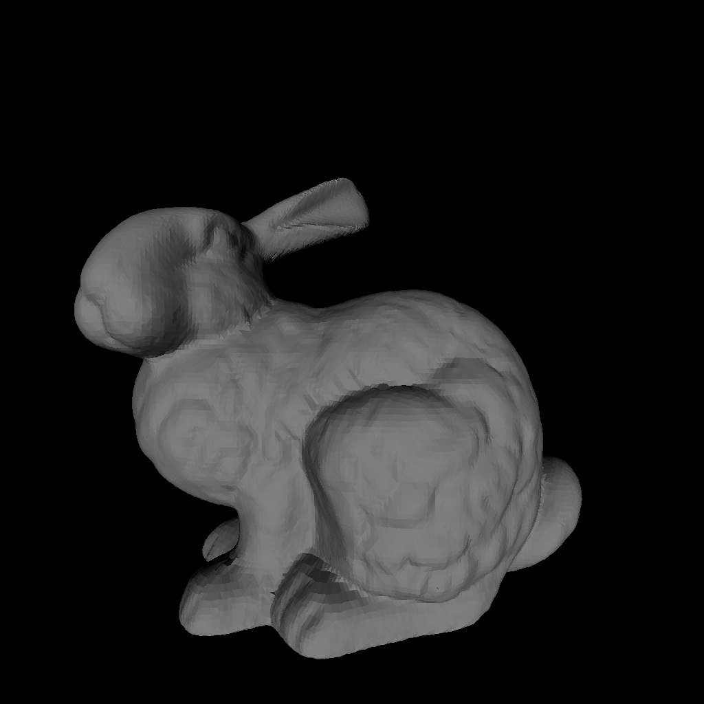

# 层次 Z-Buffer 消隐算法实现

用 C++14 从零实现的一组**消隐（hidden surface removal）算法**对比程序。全部算法手工光栅化，
**不调用任何图形 API**（无 OpenGL / DirectX / GPU），仅依赖 [glm](https://github.com/g-truc/glm)
做向量矩阵运算、[stb](https://github.com/nothings/stb) 输出 PNG。

程序依次读入 `models/` 下的 6 个 OBJ 模型（1.7K ~ 213K 面片），
分别用 6 种算法渲染 1024×1024 的图，把结果写入 `results/` 并在控制台打印耗时。

## 实现的算法

| 算法 | 说明 |
|---|---|
| 普通 Z-Buffer | 逐三角形求包围盒，盒内每个像素用重心坐标判内外，再做深度测试。作为朴素基线 |
| 经典扫描线 Z-Buffer | 图像序。建立分类边表（ET），逐扫描行维护活化边表（AET）与边对，行内增量递推 x 与深度 |
| 特化扫描线 Z-Buffer | 图元序。逐个三角形处理，按其跨越的扫描行推进，跨行状态全部放在函数栈上的局部变量里，不需要任何全局表 |
| 简单模式层次 Z-Buffer | 用 Z-max 金字塔维护深度层次，三角形先与区域最大深度比较，被完全遮挡则跳过光栅化。不预先排序 |
| 完整模式层次 Z-Buffer（**BVH**） | 在简单模式基础上叠加**模型空间** BVH，递归时对每个节点做一次遮挡判断，被遮挡则整棵子树跳过。BVH 与相机无关，可跨帧复用 |
| 完整模式层次 Z-Buffer（**八叉树**） | 同上，但场景结构换成空间八叉树。8 个子节点**互不重叠**，因此"按最小深度排序"能得到真正有效的由近到远顺序 |

## 构建与运行

```
环境：Windows + Visual Studio 2022（v143），C++14
依赖：include/glm、src/stb_image*.hpp 均已随仓库提供，无需额外配置

直接打开 HierarchicalZBuffer.sln，选择 Release | x64 运行即可。
程序的工作目录需要是工程根目录（要读 models/、写 results/），
VS 默认的调试工作目录就是 $(ProjectDir)，无需改动。
```

程序默认渲染 6 个自带模型；加上 `--sponza` 会额外渲染建筑内部场景（262 267 个三角形，
耗时较长，其中经典扫描线要 40 秒以上）：

```
HierarchicalZBuffer.exe --sponza
```

> 性能数据请务必在 **Release** 配置下采集。Debug 配置下 glm 的模板数学无法内联，
> 光栅化部分会慢 10~30 倍，而层次结构的构建只慢约 1.1 倍，
> 各算法之间的相对关系会被严重扭曲。

## 渲染结果

`results/` 下是按 `<算法>_<模型>.png` 命名的 36 张输出（加 `--sponza` 后会再多 6 张
`*_sponza.png`）。例如：

| 普通 Z-Buffer | 经典扫描线 | 特化扫描线 | 简单模式 | BVH | 八叉树 |
|---|---|---|---|---|---|
|  |  |  |  |  |  |

## 性能数据

1024×1024，MSVC /O2 /Oi /GL，AMD Ryzen 9 7945HX3D，单位 ms，取 5 次最小值，
均为单帧总时间（含各自特殊数据结构的建立时间）。

### 自带模型（低遮挡）

| 模型 | 面数 | 普通 Z-Buffer | 经典扫描线 | 特化扫描线 | 简单模式 | BVH | **八叉树** |
|---|---|---|---|---|---|---|---|
| dolphins.obj | 1 692 | 2.71 | 1.13 | **0.60** | 1.40 | 2.35 | 1.68 |
| african_head.obj | 2 492 | 4.47 | 2.13 | **1.29** | 3.33 | 3.33 | 3.09 |
| teapot.obj | 9 216 | 3.90 | 2.42 | **1.25** | 2.46 | 4.41 | 3.23 |
| bunny.obj | 69 630 | 20.47 | 18.88 | **11.97** | 20.55 | 32.50 | 18.42 |
| robot.obj | 187 983 | 58.63 | 34.15 | **17.68** | 23.59 | 75.88 | 37.10 |
| armadillo.obj | 212 574 | 27.88 | 39.81 | **23.11** | 23.59 | 88.23 | 42.61 |

这六个模型都是**单个封闭凸物体**，遮挡关系简单，所以层次 Z-Buffer 的剔除收益有限。

### 高遮挡场景（验证层次 Z-Buffer 的价值）

用 `tools/genOcclusionScene.py` 生成"体素城市"：M×M×M 个互相重叠的立方体，
每条视线要穿过 M 层几何。M=28 时是 **263 424 个三角形**，与 Crytek Sponza 同量级。

| 场景 | 三角形 | 普通 Z-Buffer | 经典扫描线 | 特化扫描线 | 简单模式 | BVH | **八叉树** |
|---|---|---|---|---|---|---|---|
| M20，**远→近**顺序 | 96 000 | 294.49 | 89.93 | 52.98 | 170.34 | 74.08 | **48.27** |
| M20，**近→远**顺序 | 96 000 | 263.17 | 90.36 | 33.40 | **22.59** | 75.44 | 50.48 |
| M28，**近→远**顺序 | 263 424 | 375.69 | 267.61 | 54.46 | **27.60** | 132.92 | 63.41 |
| M28，留缝隙 + 近→远 | 263 424 | 309.57 | 329.43 | 58.88 | 153.18 | 143.73 | **83.45** |

### 真实场景：Crytek Sponza（建筑内部）

`models/sponza.obj`，262 267 个三角形，相机放在门厅里（加 `--sponza` 参数启用）。
这是遮挡剔除领域的通用基准场景。**整栋建筑会被归一化成 2.0 × 0.84 × 1.23**
（按最长轴缩放并居中），所以机位、视锥、光照都要按室内尺度重设 —— 见下方
「场景参数」一节。

| 算法 | 渲染 | 建结构 | 总时间 |
|---|---|---|---|
| 普通 Z-Buffer | 170.44 | — | 170.44 |
| **经典扫描线** | **30.67** | 26.70 | **57.36** |
| 特化扫描线 | 40.42 | — | 40.42 |
| 简单模式 | 63.80 | 0.20 | 64.00 |
| 完整模式（BVH） | 85.95 | 75.45 | 161.60 |
| 完整模式（八叉树） | 77.04 | 25.42 | 102.63 |

**这个场景真正暴露出来的问题，与其说是「层次 Z-Buffer 能快多少」，不如说是
「不做视锥裁剪会怎样」。**

最早直接渲染时，普通 Z-Buffer 要 **5 871.91 ms**、简单模式要 418.34 ms，而且四种算法
之间的像素差异高达 **52.66%** —— 同一批三角形、同一套深度定义，结果却对不上。
排查发现：相机放进门厅后，**7 788 个三角形（2.97%）至少有一个顶点落在相机平面上或
其后**（实测相机到最近顶点的距离只有 1e-5）。透视除法会把这种顶点放大到无穷远，
它们被光栅化成盖满屏幕的巨大多边形、再带上毫无意义的深度，谁输谁赢全看数值噪声。

补上视锥裁剪（`Model::getClippedFace`，近平面在裁剪空间裁、四条侧边在屏幕空间裁）之后：

| | 裁剪前 | 只裁近平面 | **完整视锥裁剪** |
|---|---|---|---|
| 普通 Z-Buffer | 5 871.91 ms | 147.14 ms | 170.44 ms |
| 经典扫描线 | 43 903.3 ms | 3 394.77 ms | **30.67 ms（对比最初 1432×）** |
| 经典扫描线输出 | 整屏纯色（1 种颜色） | 整屏纯色 | **59 种颜色，正常** |
| 与普通 Z-Buffer 的像素差异 | 52.66% | 2.76% | 5.55% |

裁剪前的时间几乎全花在光栅化那些本就不该存在的巨大多边形上。

**只有把四条侧边也裁掉，经典扫描线才真正可用**：只裁近平面时它虽然快了 13 倍，输出却
仍是整屏纯色 —— 因为近平面裁剪只解决了「顶点被透视除法放大到无穷远」，没有解决
「三角形仍然远超视口左右/上下边界」，活动边表在这种输入下依旧退化。
裁到屏幕矩形之后它是**全场最快的扫描线实现**（渲染 30.67 ms，比只做逐三角形判遮挡的
简单模式 63.80 ms 还快）。

剔除统计（近平面剔除之后）：

| | 节点 | 被剔除子树 | 三角形测试 | 实际光栅化 |
|---|---|---|---|---|
| BVH | 32 481 | 220（0.7%） | 247 935 | 161 660（剔除 35%） |
| 八叉树 | 45 758 | 586（1.3%） | 247 290 | 181 327 |

这里有个和体素城市**相反**的现象：**节点级剔除几乎不起作用（0.7%），真正干活的是
逐三角形的金字塔测试（剔除 35%）**。原因是室内场景里物体空间的包围盒投影到屏幕上
都很大而且互相重叠，粗层判据很难判死；而单个三角形很小，被遮挡就很容易拒绝。
所以**简单模式（只有金字塔）拿到了几乎全部收益**（渲染 46.22 ms，甚至比完整模式的
67.68 ms 还快），完整模式反而要额外付出 68 ms（BVH）/ 21 ms（八叉树）的建树成本。

## 关于层次 Z-Buffer 的四条实测结论

1. **价值是真实的，但只在遮挡强烈时体现。** 完全遮屏的 M28 场景上，简单模式 27.60 ms，
   比特化扫描线快 1.97×、比普通 Z-Buffer 快 13.6×，而且只光栅化了
   **8 583 / 263 424 = 3.3%** 的三角形。而在单个凸物体上它毫无优势。

2. **前提是"由近到远"的绘制顺序。** 同一场景换成远→近顺序，简单模式要 170.34 ms，
   **慢 7.5 倍**，甚至比完全不剔除的特化扫描线还慢。遮挡剔除的全部意义就是让近处
   几何先把深度填满 —— 顺序错了，判据永远不会成立。

3. **空间划分（八叉树）显著优于物体划分（BVH）。** 全部 10 个场景上八叉树都快
   1.4 ~ 2.4 倍。原因是 BVH 的兄弟节点包围盒在深度上互相重叠，按最小深度排序只是
   弱排序；而八叉树的 8 个子节点互不重叠，排序才真正有效。剔除统计（263 424 面）：

   | 结构 | 节点访问 | 节点级剔除 | 三角形测试 | 三角形绘制 | 像素操作 |
   |---|---|---|---|---|---|
   | BVH | 16 709 | 827 | 121 022 | 74 161 | 4 280 466 |
   | 八叉树 | **8 714** | **1 854** | **46 283** | **38 721** | **3 165 887** |

4. **八叉树基本做到了顺序无关**（远→近 48.27 vs 近→远 50.48 ms），而简单模式会随
   三角形的输出顺序剧烈波动（170.34 vs 22.59 ms）。但要注意：**如果模型本身的三角形
   顺序已经是由近到远，没有建树与遍历开销的简单模式仍然更快**（27.60 vs 63.41 ms）。
   八叉树买到的是"不用预处理几何"。

5. **HZB 对"场景是否完全遮住屏幕"很敏感**：立方体之间留 15% 缝隙时，缝隙透出的远处
   几何会把"区域最大深度"拉高，剔除率骤降（八叉树 63.41 → 83.45 ms）。真实建筑场景里
   墙、地板、天花板把屏幕填满，正是 HZB 的理想工况。

### 完整模式的多帧表现

BVH 与八叉树都建在**模型空间**，与相机无关，只构建一次、之后每帧复用；
每帧的固定开销只有重建 Z-max 金字塔（0.20 ms）与重算屏幕投影。

| 模型 | BVH 复用后每帧 | BVH 每帧重建 | 加速 |
|---|---|---|---|
| bunny.obj | 16.75 | 29.07 | 1.74× |
| robot.obj | 36.50 | 71.62 | 1.96× |
| armadillo.obj | 34.60 | 89.23 | 2.58× |

## 目录结构

```
src/
  main.cpp                     程序入口：遍历模型 × 算法
  scene.hpp/.cpp               场景参数与 MVP 变换
  model.hpp/.cpp               OBJ 加载、面数据存储、三角形轴向包围盒
                               （屏幕空间 / 模型空间 / 有符号 z 各一份）
  basicZBuffer.hpp/.cpp        普通 Z-Buffer
  scanlineZBuffer.hpp/.cpp     经典扫描线 + 特化扫描线（setMode 切换）
  basicHierarchicalZBuffer.*   简单模式层次 Z-Buffer
  hierarchicalZBuffer.*        完整模式层次 Z-Buffer（BVH / 八叉树，setSceneStructure 切换）
  zPyramid.hpp                 Z-max 金字塔：层次 Z-Buffer 的深度层次结构
  triangleRasterizer.hpp       四种算法共用的扫描线光栅化内核
tools/
  genOcclusionScene.py         生成高遮挡测试场景（体素立方体城市）
include/glm/                   第三方：向量矩阵库
models/                        测试模型
results/                       渲染输出（36 张）
```

## 实现要点

**共用的扫描线光栅化内核**（`triangleRasterizer.hpp`）
把三角形按扫描线切成"上半部分 / 下半部分 / 退化成水平线"三种情况，逐行从左到右遍历。
各算法只有"深度测试 + 写入深度"这一步不同
（普通 z-Buffer 写 Z-Buffer；层次 z-Buffer 还要向上更新金字塔），
因此把它做成回调参数、经模板内联展开，**三个类合计 515 行重复代码收敛为 201 行共享实现**。

**深度逐像素代回平面方程求值**（而不是沿扫描线累加状态）
解出深度增量的 dzx、dzy 之后，平面就是已知的：
`z(x, y) = face[0].z + (face[0].y - y) * dzy + (x - face[0].x) * dzx`，每个像素直接代入。
原先的写法是逐行累加 `z += dxleft * dzx + dzy`，问题出在这两项经常是一对量级相同、
符号相反的大数——三角形越窄长越极端（实测单步两个增量分别是 +13.34 和 −13.36，
真实变化只有 0.002），相减本身就是一次大数相消，误差再乘上成百上千行就积成了
肉眼可见的深度错误。

另一处必须同时处理：像素范围是用 `static_cast<int>` 向零截断得到的，
最左/最右那个像素的整数坐标可能落在该扫描行的真实跨度之外最多 1 像素。
对普通三角形这点外推无所谓，但窄长三角形 `dzx` 可以到几十，外推出去深度会被甩出视锥。
所以求值位置先夹回跨度之内——对跨度内的像素这是恒等变换，取值完全不变。

**视锥裁剪**（`Model::getClippedFace`）
分两步，因为这两步需要的信息不一样：

- **近平面在裁剪空间裁**。本工程里齐次坐标的 `w` 就是 `z_cam`，所以判据只跟 `w` 有关：
  `w <= -nearDistance`。用 Sutherland-Hodgman 对三角形裁一刀，裁出来最多 4 个顶点。
- **四条侧边在屏幕空间裁**。这里有个坑：本工程把**视口变换也乘进了 MVP**，所以
  `x_clip / w` 得到的已经是 `[0,W] x [0,H]` 的**像素坐标**，不是 NDC ——
  不能照搬「NDC 落在 [-1,1]」去写 `x = ±w` 的判据（第一版就是这么写错的，结果整屏全黑）。
  直接在屏幕空间对 `x ∈ [0,W]`、`y ∈ [0,H]` 各裁一刀即可；投影之后三角形在屏幕上的投影
  仍是三角形、深度仍是屏幕坐标的线性函数，所以这样裁是精确的。

裁完按扇形三角化成最多 6 个三角形。**这是让经典扫描线可用的关键**：只裁近平面时，
三角形仍可能远超视口左右/上下边界，活动边表会被撑爆（实测 43.9 秒、输出整屏纯色）；
裁到屏幕矩形后降到 30.67 ms 且输出正常。

**按屏幕面积跳过退化的三角形**
屏幕空间面积 = |c| / 2，低于 0.01 平方像素就整个跳过。
三个顶点几乎共线时，过这三点的平面本身就是病态的：实测某个三角形三个顶点的深度
只相差 0.0025，解出来的 dzx 却是 **−2.12/像素**（即每挪动一个像素深度就变化 2.12，
比它自身的深度跨度大三个数量级）——因为另外两个顶点只相距 0.001 像素、深度却差 0.0025，
平面把这个比值当成了真实斜率。这种三角形的片元深度没有任何意义，而它本来也覆盖不到
一个像素，跳过它既修掉噪声、又省掉无谓的遍历。

**经典扫描线做了同样的三件事**（`scanlineZBuffer.cpp`）：给活动边表补上「左边缘进入扫描线时的
参考点 (xRef, yRef, zRef)」，渲染时同样用平面方程求值、把求值位置夹回跨度、并按面积跳过
退化三角形。

**深度一律取 -z，不取 |z|**
本工程的投影把近平面映到 z_ndc = +1、远平面映到 -1（即所谓反向 Z，z_ndc 随距离单调**递减**）。
而 z-Buffer 的常规约定是「深度越小越近、z-test 用 `<`」，要求深度随距离单调**递增**，
所以统一取 **-z**：它把整个视锥线性翻转回来，取值正好落在 [-1, +1]，与常规深度缓冲一致，
而且就是同一个 float 取负，没有任何额外开销。

`|z_ndc|` 则是关于距离的 V 形函数：在 z_ndc 的过零点取到最小值 0，而这个点在本工程的
参数下位于相机前方 **0.598** 处 —— 那是视锥**内部**（近平面在 0.3），不是近平面。
也就是说 d < 0.598 的那段几何前后关系会被整体反转：离相机**更近**的反而被判为更远。
自带 6 个模型在默认机位下全部落在 d ∈ [0.885, 2.715]，完全没碰到这个区域，
所以对**所有合法片元**两种写法逐位相同；但把相机推到 z = 1.3、让 bunny 进入 d_min = 0.525 后，
两种写法有 **21 660 个像素（2.07%）** 不同 —— 正好是跨过 0.598 的那个模型。

**场景参数可配置**（`scene.hpp` 的 `Scene::Config`）
相机位置/朝向、上方向、光线方向、视锥（near/far/fov）、环境光强度、渲染分辨率
全部可以按场景指定。默认值与重构前完全一致，所以不带参数时输出逐位不变。

这不是过度设计：自带模型都是**放在相机前面的单个凸物体**，默认相机 (0,0,1.8)、
fov 90、近平面距离 0.3 就够了；但建筑类场景要求相机**在模型内部**，
而且模型会被 `Model::loadModel` 按最长轴归一化到 [-1,1]³ —— 整栋 sponza 因此只有
2.0 × 0.84 × 1.23，近平面 0.3 就吃掉了建筑高度的三分之一，fov 90 下任何近处的墙
都会糊满整个画面。

同时加了一项**环境光**（默认 0）：只有单向光时 `max(0, dot(N, L))` 会把所有背光面
渲染成纯黑，对凸物体没问题，对建筑内部就只剩一片黑。

**Z-max 金字塔**（`zPyramid.hpp`）
用 mipmap 式的连续数组代替指针四叉树：第 0 层是逐像素的深度，第 L 层的每个单元覆盖
2^L × 2^L 像素、存该区域的最大深度，父单元是 `(x >> 1, y >> 1)`。
1024×1024 时共 1 398 101 个 float 约 **5.6 MB**，全部连续存储、没有任何指针。

相比之下，指针四叉树有同样多的节点，但每个节点是 2 次堆分配（节点对象 + children 数组），
合计约 280 万次 malloc、约 100 MB，**构建要 92 ms 且只与分辨率有关、与面数无关 —— 每个模型都要白付一次**。
换成金字塔后构建退化成一次内存填充（**0.20 ms**），而且因为访存连续，
连渲染本身也快了 2~5 倍。这是整个项目里收益最大的一次优化。

**遮挡判据与保守性**
若某区域的**最大深度**小于三角形的**最小深度**，则该区域内的任何片元都会被已有几何的
z-test 拒绝，可以整块跳过。判据是保守的 —— 不满足时可能白跑，但绝不会错误剔除。
写一个像素后要沿父链向上更新区域最大深度，且只在值真的变小时才继续往上走。

**两种场景加速结构**（完整模式）
都建在模型空间、与相机无关，可跨帧复用；渲染时把节点包围盒投影到屏幕空间
（投影 8 个角点后取包围盒 —— 透视投影把凸多面体映射成凸多边形，其屏幕包围盒与
深度极值必然在角点上取到）。递归时对每个节点先做一次遮挡判断，从粗层开始逐层下探；
一旦被判为遮挡，整棵子树直接返回。

- **BVH**：按循环轴 + 中位数划分的二叉树，叶子最多 20 个三角形
- **八叉树**：把归一化到 [-1,1]^3 的模型包围盒不断八等分，三角形按重心落到哪个
  八分体分组，叶子最多 20 个三角形、深度上限 16。每个节点同时存两份范围：
  互不重叠的**八分体单元**（用于排序）与节点内三角形的**紧包围盒**
  （三角形按重心分配可能略微越界，遮挡判断必须用它才安全）

**几个容易踩的坑**

- *顶点 y 坐标取整*：相邻三角形共享一条边。若不把顶点 y 取整，浮点误差会让这条边在两个
  三角形里算出不同的起始扫描行，屏幕上会出现裂缝。
- *边对的左右判定必须分两种情况*：两条边共用上顶点时（普通三角形）此刻 x **完全相同**，
  只能比较每扫描行的 x 增量 dx；共用下顶点时（上平底三角形）此刻 x 不同，且 dx 的大小
  关系与左右**相反**（设两条边从 xp、xq 收敛到底顶点 xr、跨越 H 行，则 d1 = (xr−xp)/H、
  d2 = (xr−xq)/H，因 H > 0 故 d1 < d2 等价于 xp > xq），此时必须直接比较 x。
  实测把这一支改成"一律比 dx"，6 个模型最多有 6.2% 的像素出错。
- *z 轴存的是 |z|*：深度缓冲区里 |z| 越大越远，所以 `getObjectAxisMinimum/Maximum(i, 2)`
  返回的是 |z| 的极值、`getObjectAxisCenter(i, 2)` 恒为非负。用它做三维空间划分会让
  所有三角形都落进 +z 一侧（八叉树退化成四叉树），用它做包围盒会让前后两侧算出完全
  相同的 z 范围。**必须用有符号版本**（`getObjectCentroid` / `getObjectZMin/Max`）。
- *视图矩阵的乘法顺序*：本工程用的是行向量约定（`p * M`），点的视图变换是
  `p * (T * R) = (p - camera) * R`，必须**先平移、再旋转**。写成 `R * T` 就变成了
  `p * R - camera`，即先旋转、再在世界坐标里减相机位置 —— 只要相机**不在原点**且
  **朝向不是 (0,0,-1)**，旋转矩阵就不是单位阵，两者结果不同。症状很好认：
  朝向 (-1,0,0) 时，沿 x 移动相机物体只会左右平移、沿 z 移动才会变近变远（正好相反）。
  默认机位恰好是单位旋转，所以这个问题藏了很久才被使用者发现。
- *退化三角形不能只靠 `|c| < EPSILON` 判*：`c` 是 2 倍屏幕面积，原阈值 1e-5 只管住了
  面积恰好为 0 的情形。实测机器人模型里存在三个顶点只差 0.001 像素的细条，`|c|` 约 0.002
  照样通过阈值，但它的深度平面已经完全是噪声。阈值要按面积给，并且要直接跳过——
  留着重算只会把噪声画到屏幕上。

## 已知局限与后续工作

- **八叉树的建树成本在单帧下不可忽略**（263 424 个三角形约 17 ms）。它只在多帧复用或
  需要"顺序无关"时才划算。
- **每帧要重新投影节点包围盒**（每节点 8 个角点），这是物体/空间划分方案为换取跨帧复用
  而付出的固定成本。可以缓存屏幕投影、只在相机变化时重算，但那对相机每帧都在动的
  真实场景没有意义。
- **视锥裁剪只做到「三角形被裁成凸多边形」，没有再往下拆**：一个三角形最多可能被裁成
  8 个顶点（近平面 + 四条侧边），按扇形拆成最多 6 个三角形，重复的边会被光栅化两次。
  三角形级别的重复影响很小，但如果以后要做逐三角形的统计（例如精确的三角形通过率），
  需要把重复计算剔除掉。
- **尚余极少量越界深度，量级已在浮点精度范围**：合法片元是三个顶点深度的凸组合、不可能越界。
  按屏幕面积跳过退化三角形之后，剩余越界样本的最大幅度从 +18.90 / −37.22（比整个视锥
  [-1, 1] 还大一个多数量级）降到 1.3e-5 ~ 1.2e-3，即万分之一量级。剩下的主要来自
  「扫描行的跨度本身比三角形在该行略宽」这类边角情形。
- **深度并列时的仲裁顺序取决于数据结构遍历顺序**，不同实现会得到极少量不同的像素。
  需要完全可复现的输出时，应当显式规定仲裁规则（例如按三角形 ID 排序）。

## 参考

- Greene, Kass, Miller. *Hierarchical Z-Buffer Visibility*. SIGGRAPH 1993.
- 向量矩阵运算：[glm](https://github.com/g-truc/glm)
- PNG 读写：[stb](https://github.com/nothings/stb)